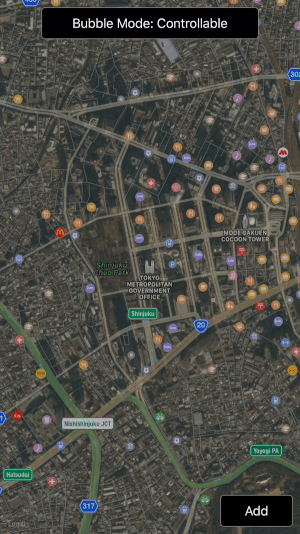
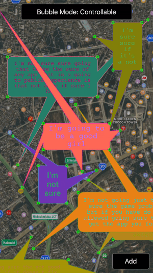
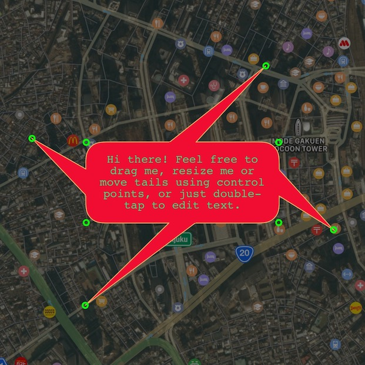
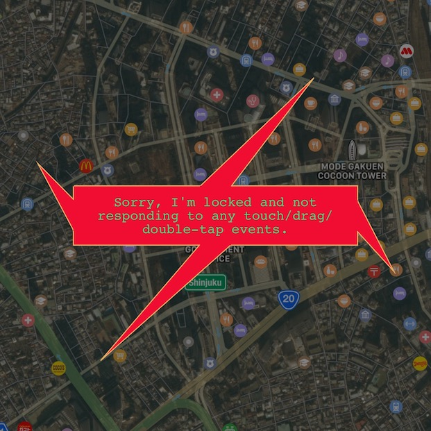
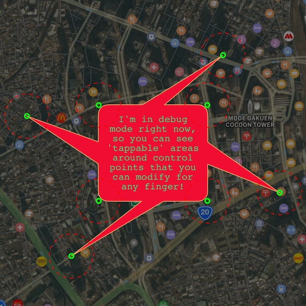

# DynamicBubble [](https://opensource.org/licenses/Zlib) 

DynamicBubble view gives app user power to construct speech/annotation bubbles using built-in control points and gestures.

 

## Usage

### Create bubble with initial set of tails
```swift
let bubble = DynamicBubble(centerPoint: view.center, originSides: [.down, .up, .left, .right], bubbleSize: CGSize(width: 200, height: 100))
// OR
let bubble = DynamicBubble(centerPoint: view.center, originSides: [.down, .up, .left, .right])
// OR
let bubble = DynamicBubble(centerPoint: view.center)

view.addSubview(bubble)
```

### Customize colors, form and behaviour if needed
All properties have default values, so this step is optional.
```swift
// Appearance

bubble.textFont = UIFont(name: "Helvetica-Bold", size: 17.0)
bubble.textColor = UIColor.darkGray
bubble.textAlignment = NSTextAlignment.center
bubble.fillColor = UIColor.lightGray
bubble.strokeColor = UIColor.darkGray
bubble.controlsColor = UIColor.green
bubble.controlsRadius = 3

// Behaviour

/* Whether or not to show control points */
bubble.showsControls = true

/* Whether or not to lock user interaction */
bubble.reactsToControls = false

bubble.bringToFrontWhenActive = true
bubble.startsWithActiveTextBox = false
bubble.debugMode = false
```
Although changing most of these properties results in bubble being re-drawn, it's still recommended to call `bubble.setNeedsDisplay()` after that.

### Add/Remove tails on the fly
At the moment, there is no built-in visual interface to add/remove tails (TBD), but there are methods to do this, so you can provide your users with whatever UI you want to call them.
```swift
bubble.addTailAtSide(.down)
bubble.removeTailAtSide(.up)
```

<hr>

### Built-in controls
There is pretty much everything for user to control bubble on screen.

## Control points and gestures


## Locked mode


## Debug mode


<hr>

## ToDo's
+ Add visual controls for tails add/remove actions
+ Add support for higher rounding values (circle bubbles)

## License
DynamicBubble is released under the permissive zlib License. See the [LICENSE](https://raw.githubusercontent.com/0xNSHuman/DynamicBubble/master/LICENSE.md) file.
